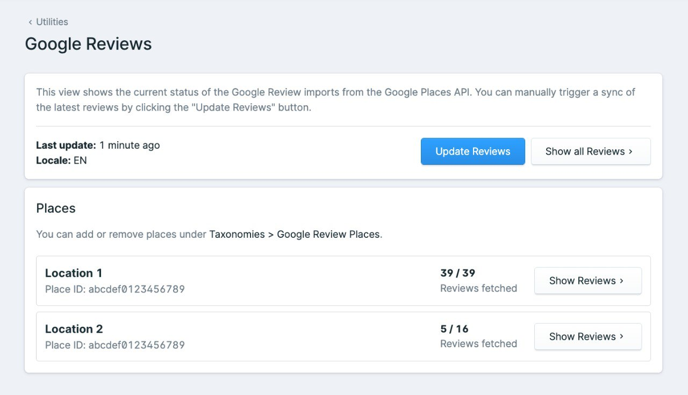

# Statamic Google Reviews

[](https://statamic.com)
[](https://statamic.com)

Display Google Reviews on your Statamic site using the Google Places API.

## Features

This Statamic addon fetches Google customer reviews for one or multiple locations using the Google Places API.

> [!NOTE]
> This addon does not require the Google My Business API, which makes it easier to set up and use.

✅ Simple configuration<br>
✅ Supports multiple locations<br>
✅ Reviews are cached in a collection<br>
✅ Manual review editing and removal<br>
✅ No client-side API calls to Google - GDPR compliant<br>

## 🛠️ How to Install

You can search for this addon in the `Tools > Addons` section of the Statamic control panel and click **install**, or
run the following command from your project root:

``` bash
composer require emplify-software/statamic-google-reviews
```

After the addon is installed, publish the configuration file, blueprints and collections for the addon by running:

``` bash
php artisan vendor:publish --tag=statamic-google-reviews
```

After running the publish command, you will find the configuration file at `config/statamic-google-reviews.php`.
Since you can define all configuration options in the `.env` file (see [Configuration](#configuration)), you normally do not need to edit the configuration file directly.
A new collection called `Google Reviews` will also be created, as well as a new taxonomy called `Google Review Places`.

## 💡 How to Use

### Generating an API Key for Google Places API

1. Use an existing Google Cloud project or create a new one at [Google Cloud Console](https://console.cloud.google.com/).
2. Create a new API key for the project:
   * Go to the [Google Maps Platform > Credentials](https://console.cloud.google.com/project/_/google/maps-apis/credentials) section and select the project.
   * Click **Create credentials** and select **API key**.
   * Under **API restrictions**, select **Places API** or **Places API (New)**.
   * The API key will be displayed on the screen.

### Configuration

1. Add your Google Places API key to the `.env` file:

    ```dotenv
    GOOGLE_REVIEWS_API_KEY=your-api-key
    ```
    
2. Reviews can be retrieved with translated texts. Per default, the current app locale is used as the language for the reviews. If you want to use a different language, set `GOOGLE_REVIEWS_LANGUAGE` in the `.env` file:
    
   ```dotenv
   GOOGLE_REVIEWS_LANGUAGE=de
   ```

3. If you are using the legacy "Places API" (not "Places API (New)"), set `GOOGLE_REVIEWS_LEGACY_API` to `true` in the `.env` file:

    ```dotenv
    GOOGLE_REVIEWS_LEGACY_API=true
    ```

### Adding Places

The addon automatically generates a taxonomy called `Google Review Places`.
To register a new place, follow these steps:

1. Go to `Taxonomies > Google Review Places` in the control panel 
2. Click **Create Term**
3. Enter a name for the place. You can name it whatever you want, e.g. "My Restaurant" or "Berlin Office".
4. Enter the Google Place ID for the location. You can find the Place ID by searching for the location on the [Place ID Finder](https://developers.google.com/maps/documentation/javascript/examples/places-placeid-finder).
5. Click **Save & Publish**
6. The latest reviews for the new place will automatically be fetched after saving the term. If the place has reviews, you will now see them
   under `Collections > Google Reviews` in the control panel.

### Fetching Reviews

You can manually fetch the reviews for all registered places by running the following command:

``` bash
php artisan emplify-software:google-reviews:crawl
```

### Scheduling Review Fetching

To keep the reviews up-to-date, you can set up a scheduled task to automatically fetch the reviews at regular intervals.
Like any other command, you can schedule the `emplify-software:google-reviews:crawl` command in the console kernel:

```php
// app/Console/Kernel.php
protected function schedule(Schedule $schedule)
{
    $schedule->command('emplify-software:google-reviews:crawl')->daily();
}
```

If you are using Laravel 11 or later, you can also directly add the schedule command to the `routes/console.php` file:
```php
// routes/console.php
use Illuminate\Support\Facades\Schedule;

Schedule::command('emplify-software:google-reviews:crawl')->daily();
```

If the crawling command fails, it will return an error code, which can be handled in the scheduler if needed: 
```php
$schedule
    ->command('emplify-software:google-reviews:crawl')->daily()
    ->onFailure(function () {
        // Handle the failure, e.g. send a notification
    });
```

### Removing and editing reviews

The reviews are stored in a collection called `Google Reviews` (`Collections > Google Reviews`).
To remove a review, simply unpublish it.

> [!NOTE]
> Do not completely delete reviews from the collection. Deleted reviews will be re-fetched on the next crawl. 

It is also possible to edit the review content in the entry (e.g. to fix spelling mistakes or adjust the translation).
To make sure the review is not overwritten on the next crawl, activate the `Manual Override` switch for the entry.


### Displaying Reviews

You can display the reviews on your site by iterating over the `Google Reviews` collection using the `collection:google-reviews` tag:

```antlers
{{ collection:google-reviews }}
    <div>
        <div>
            Author: {{ author_name }}
        </div>
        
        <div>
            Rating: {{ rating }}
        </div>
        <div>
            Time: {{ time }}
        </div>
        <div>
            Text: {{ text }}
        </div>
        <div>
            Place: {{ place['title'] }}
        </div>
    </div>
{{ /collection:google-reviews }}
```

Since the reviews are stored in a collection, you can also use the collection tag to filter and sort the reviews as needed (See https://statamic.dev/tags/collection).

*Example: Only display the reviews for a specific place:*

```antlers
{{ collection:google-reviews place:is="location-a" }}
    ...
{{ /collection:google-reviews }}
```

## 🎛️ Control Panel Utility

Under `Utilities > Google Reviews`, you can see the current status of the review crawlers.
With the "Update Reviews" button, you can also manually trigger a fetch of all reviews.

Additionally, you can see a list of all registered places.
If a place ID is incorrect or if the reviews could not be fetched for some other reason, an error message will be displayed for the place.
You can also see how many reviews are locally stored for each place and how many reviews are actually available on Google (see [Known Issues](#-known-issues)).



## ⚠️ Known Issues

* Due to a limitation in the Google Places API, only the last 5 reviews can be fetched. This is not a problem for new reviews, because all reviews are fetched and stored in the collection.
  However, if you already have more than 5 reviews on a place and you add it to the addon, only the last 5 reviews will be fetched.
  If you also want to display older reviews, you can manually add them to the `Google Reviews` collection.
* When using the "Places API (New)", it can also no longer be guaranteed that all new reviews will be fetched. 
  This is due to the fact that the new Places API does not return the latest reviews, but only a selection of reviews that are
  considered relevant by Google.
